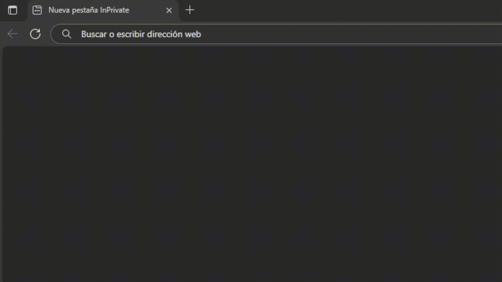
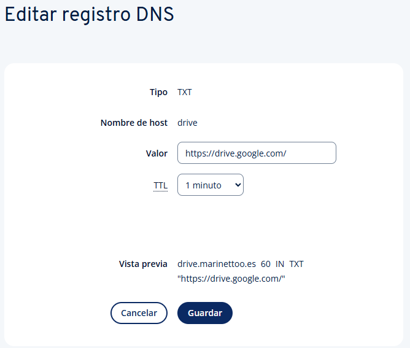
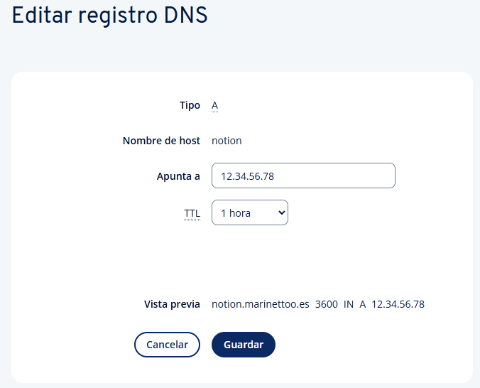
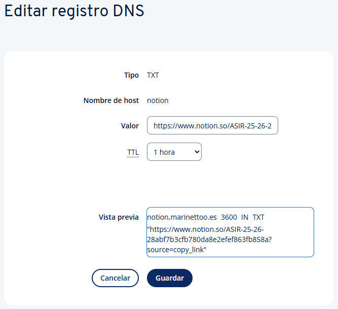

# DNS Redirector
This project allows us to create a Flask server that redirects DNS queries to a specified IP address.


## Installation
1. Clone the repository
2. Install the required packages
   ```bash
   pip install -r requirements.txt
   ```

## Usage
1. Run the Flask server 
   ```bash
   python app.py
   ```
2. Configure your domain's DNS settings to point to the server's IP address. 
   Add an A record for your domain (or subdomain) pointing to the server's IP address. For the same subdomain, add a TXT record containing the redirect URL.



3. Execute a DNS query to test the redirection
   ```bash
   dig @your_server_ip your_domain TXT
   ```

**Note:** In the example below, `12.34.56.78` is a placeholder IP address. Will appear replaced with your actual server IP.

Example:
```bash
user@device:~ $ dig drive.marinettoo.es

; <<>> DiG 9.20.15-1~deb13u1-Debian <<>> drive.marinettoo.es
;; global options: +cmd
;; Got answer:
;; ->>HEADER<<- opcode: QUERY, status: NOERROR, id: 55159
;; flags: qr rd ra; QUERY: 1, ANSWER: 1, AUTHORITY: 0, ADDITIONAL: 1

;; OPT PSEUDOSECTION:
; EDNS: version: 0, flags:; udp: 512
;; QUESTION SECTION:
;drive.marinettoo.es.           IN      A

;; ANSWER SECTION:
drive.marinettoo.es.    60      IN      A       12.34.56.78 (example IP)

;; WHEN: Mon Nov 03 11:40:59 CET 2023
;; SERVER: 192.168.1.1#53(192.168.1.1) (UDP)
;; WHEN: Mon Nov 03 11:40:59 CET 2025
;; MSG SIZE  rcvd: 64
```
If you see the IP address in the ANSWER SECTION, the redirection is working correctly.

4. Open a web browser and navigate to the redirected URL.
```bash
name.domain.com
```
It will redirect you to the URL specified in the TXT record of your domain's DNS settings.

5. Adding more subdomains
To add more subdomains for redirection, simply create additional A and TXT records in your domain's DNS settings for each subdomain you want to redirect. Each record should contain the URL you want that subdomain to redirect to. 



### Licence
This project is open source and its use is free.