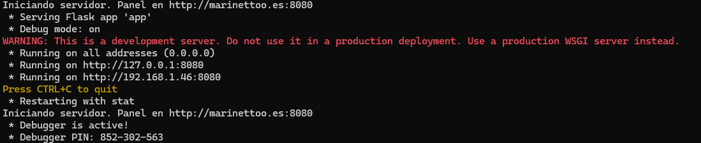
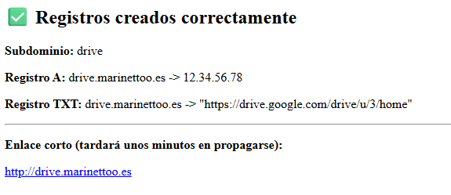

# DNS Redirector
This project provides a complete web dashboard to create and manage DNS-based URL redirections. It uses the IONOS API to automatically create the necessary A and TXT records, turning your domain into a powerful custom link shortener service.


## Features:
- Web Dashboard: A web interface to easily add new redirections.
- API Automation: Connects directly to the IONOS API to instantly create A and TXT records.
- Custom Subdomains: Creates custom links (e.g., hello.yourdomain.com).
- Short Links (Hash): If you leave the subdomain field blank, it generates a short hash (e.g., a3f6b1.yourdomain.com).

## Installation
1. Clone the repository
2. Install the required packages
   ```bash
   pip install -r requirements.txt
   ```
3. Obtain your domain API Key and Zone ID (depends on your Domain provider).

## Usage
1. Configure your .env document with your:
   - API key
   - Zone id
   - Base Domain
   - Server Public IP Address
  
2. Run the Flask server 
   ```bash
   python app.py
   ```
3. When running the script, it will tell us where is it running (example:)

   

4. If we enter into the IP Address it gives us, we will see this Web page:

   

   Fill it with the subdomain you want to create.

5. When pressing the button, this page will appear
   
   
   

6. Execute a DNS query to test the redirection
   ```bash
   dig @your_server_ip your_domain TXT
   ```

**Note:** In the example below, `12.34.56.78` is a placeholder IP address. Will appear replaced with your actual server IP.

Example:
```bash
user@device:~ $ dig drive.marinettoo.es

; <<>> DiG 9.20.15-1~deb13u1-Debian <<>> drive.marinettoo.es
;; global options: +cmd
;; Got answer:
;; ->>HEADER<<- opcode: QUERY, status: NOERROR, id: 55159
;; flags: qr rd ra; QUERY: 1, ANSWER: 1, AUTHORITY: 0, ADDITIONAL: 1

;; OPT PSEUDOSECTION:
; EDNS: version: 0, flags:; udp: 512
;; QUESTION SECTION:
;drive.marinettoo.es.           IN      A

;; ANSWER SECTION:
drive.marinettoo.es.    60      IN      A       12.34.56.78 (example IP)

;; WHEN: Mon Nov 03 11:40:59 CET 2023
;; SERVER: 192.168.1.1#53(192.168.1.1) (UDP)
;; WHEN: Mon Nov 03 11:40:59 CET 2025
;; MSG SIZE  rcvd: 64
```
If you see the IP address in the ANSWER SECTION, the redirection is working correctly.

7. Open a web browser and navigate to the redirected URL.
```bash
name.domain.com
```
It will redirect you to the URL specified in the TXT record of your domain's DNS settings.

## Licence
This project is open source and its use is free.
